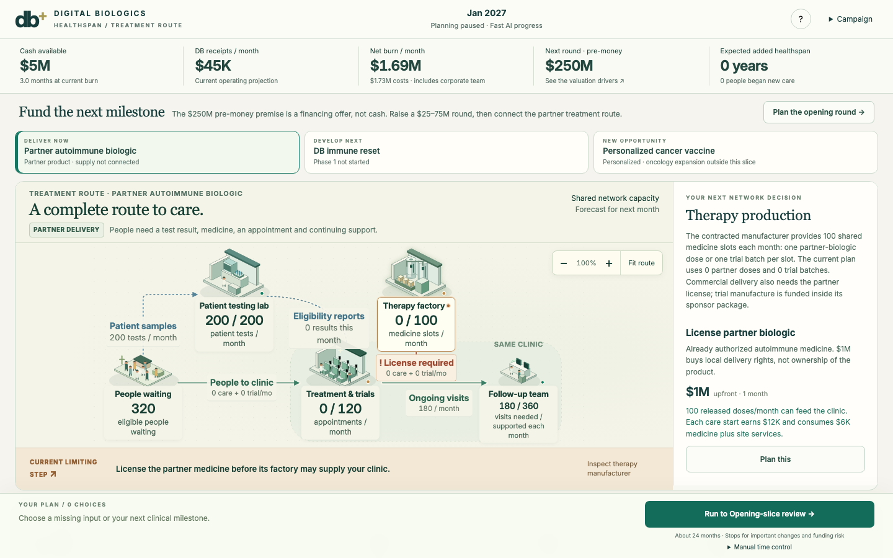

# Digital Biologics: Healthspan

A playable strategy prototype about building the infrastructure that turns AI-designed therapies into patient care.

**[Play in your browser](https://hrajanie.github.io/digital-biologics-healthspan/)** · **[Design documents and concept art](https://github.com/hrajanie/digital-biologics-healthspan-design)** · [Visual design guide](https://hrajanie.github.io/digital-biologics-healthspan-design/)



## What is playable now?

The default experience is a compact **treatment-route slice**, beginning in January 2027 and ending at the first Phase 1 readout or after 24 simulated months. It tests whether a visible chain of patients, testing, manufacturing, clinical care and follow-up makes business choices understandable.

- License a partner biologic to deliver care and earn revenue.
- Fund and staff a clinical study for DB's own immune-reset candidate.
- Relieve specific capacity bottlenecks and see how the treatment route changes.
- Respond to improving AI designs: finish the current study, replace its candidate, or develop a parallel version.
- Choose how much money to raise; inspect dilution, milestone-sensitive fundraising value, operating value and an illustrative investor stake.
- Advance directly to the next decision, with a news summary of what changed.

The longer 2027–2050 network campaign, billion-healthspan-year objective, personalized regulation and advanced home-care technologies are **design ambitions, not completed features of this slice**. Earlier experimental editions remain available through the prototype's links; the treatment-route edition is the version to start with.

## First play

1. Open the game and choose **Plan the opening round**.
2. Fund a plan, license the partner biologic and inspect the route's capacity limits.
3. Switch between **Deliver now** and **Develop next** to balance current care with clinical development.
4. Commit the plan and run to the next decision. Read the news, then inspect the bottleneck or new opportunity.

The opening $250M pre-money valuation and all other economic assumptions are fictional game inputs. Dollar amounts are unscaled US dollars in the interface; the simulation stores integer cents. Candidate outcomes are simulated, and a study can fail.

## Run locally

Use Node.js 22.12 or later and npm.

```sh
npm ci
npm run dev
```

Open the local address printed by Vite. No API keys, live AI service or account is required. Saves remain in your browser; use the game's export/import controls to transfer a playtest between browsers or computers. A new browser or the public website has separate local saves.

## Verify

```sh
npm test
npm run build
npm run benchmark
```

For the browser checks, install Playwright's browser binaries, start a local preview in one terminal, then run the harness in another:

```sh
npx playwright install chromium firefox webkit
npm run preview -- --port 4200
```

```sh
npm run test:browser
```

The harness generates its own simulated fixtures before testing Chromium, Firefox and WebKit. Set `FLOW_URL` to test a different served address. Generated screenshots, results and replays stay in the ignored `artifacts/` directory. [Verification records](verification/) distinguish original prototype checks from public-package checks; automated checks do not establish human enjoyment or investor persuasion.

## Project map

| Location | Purpose |
| --- | --- |
| `src/flow/` | Current treatment-route interface and simulation |
| `src/network/` | Earlier network prototype |
| `src/core/`, `src/world/`, `src/ui/` | Original full-campaign experiment |
| `tests/` | Determinism, clinical, financial, allocation and interface-model checks |
| `scripts/` | Balance runs, browser checks and website packaging |
| `public/network-art/` | Generated concept illustrations used in the prototypes |
| `docs/` | Prebuilt GitHub Pages website |

There are no live model calls, multiplayer, cloud saves or patient-encounter minigames. Financial and clinical results are illustrative game outcomes, not an actual financing offer or medical evidence.

## Update the shared website

```sh
npm run build:site
```

Commit the updated source and `docs/` together. GitHub Pages serves the `docs/` directory on `main`. `vite.config.ts` uses relative asset paths so workers and assets work beneath the repository's Pages URL.

## Feedback

Please open an issue with the edition, visible date, what you tried, what you expected and what happened. An exported **simulated game save** and screenshot can help reproduce a problem. Public issues are visible to everyone; include game content only.

The repository contains a fresh public snapshot, with no private research, supplied newspaper article, real patient records or original development history. Concept illustrations are generated artwork. No general reuse license has been added for the original code or artwork. Bundled third-party software retains its own terms in [THIRD_PARTY_NOTICES.txt](public/THIRD_PARTY_NOTICES.txt).
